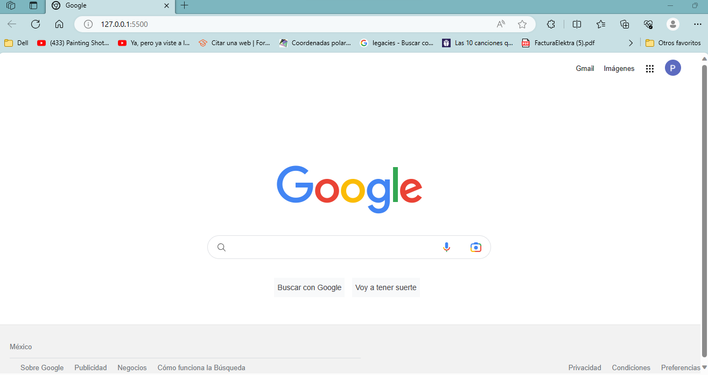

# clon-google
Proyecto creado en **Tecnolochicas Pro** simulando la página principal del navegador de Google
******
Poniendo en practica lo aprendido en el bootcamp logré realizar un clon del explorador de google
## 1. Intro
El proyecto fue creado con **HTML y CSS** se trata del navegador más usado, la interfaz de Google
* Puedes visitar el sitio del siguiente enlace

**Inspirate de la realización de este proyecto, utiliza tu destreza y aprendizaje para demostrar que tu futuro es ser desarrolladora frontend 💪**

## Contenido del proyecto
1. Header
Sección muestra el menú y la foto de perfil
2. Main
Contiene los elementos centrakes de el buscador
3. Footer
Incluye hipervínculos al final de la página
>Realizado por Paola Ortiz Miranda ⚙️
